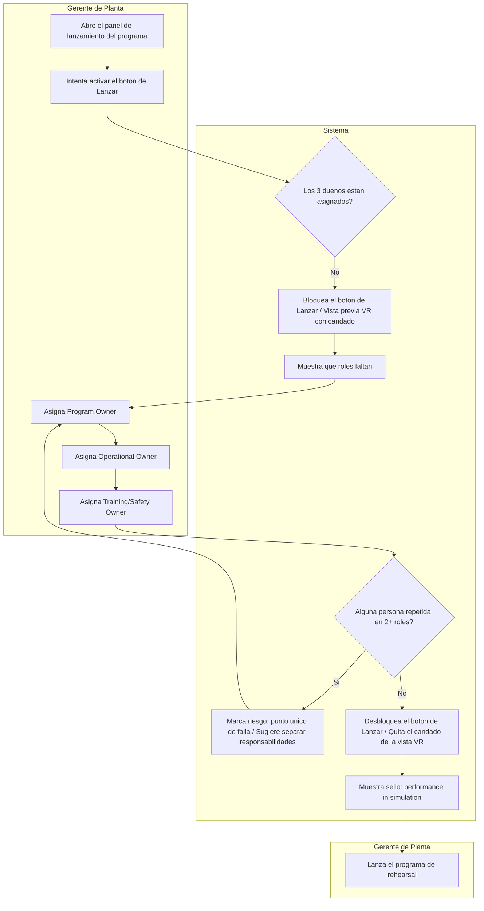

# PACKET — Week 6 Business Bending
**Operator: Karom Asael González Martínez**

## Problem (in my own words)
Mexican law already requires every school, hospital, and business to maintain a documented civil-protection program with drills, but nothing verifies that the program actually has real people accountable for it before it launches. A VR rehearsal program for institutional responders (following the team's Compliance Upgrade vacuum) risks launching the same way: no one owns the program, no one owns day-to-day operation, no one owns training safety, and nobody notices until something fails.

## Exact user
A Plant Manager (Gerente de Planta) at a Mexican industrial facility who is responsible for activating the VR rehearsal program for their emergency-response brigade, across one or several plant sites.

## Success definition
Before the module closes, a Plant Manager can open the launch panel for a plant with no owners assigned, see the launch button disabled and the VR preview locked, assign the three required owners (program, operational, training/safety) one by one, see a conflict warning if the same person is assigned to more than one role or across plants, and once all three are validly assigned, see the launch button unlock and the VR preview lose its lock, with a "performance in simulation" label shown.

## Mockup
See attached screenshot (generated mockup): launch readiness panel with owner checklist, conflict warning banner, locked VR preview, disabled launch button, and a 3-plant status map.

## Flow diagram (Mermaid)

## The world's best attempt
Best existing solution: Permit-to-Work and Lockout-Tagout systems already used in Mexican industrial plants (required under NOM-STPS), which block high-risk work from starting until a named authorized employee signs off, combined with enterprise release-readiness checklists that require each launch section to be signed by a named owner before go-live. Mine differs by applying this same gating logic not to physical maintenance work or a software release, but to launching a measured VR rehearsal program, and by requiring three specific roles (program, operational, and training/safety owner) drawn directly from the team's Blueprint conditions, rather than a generic single approver.

## The long-view paragraph
If this workflow proves itself in one factory, the natural path is for it to become the standard governance layer for every civil-protection training program in Mexico, not just VR rehearsal. In three years, this ownership-gating logic could sit underneath any mandated drill format nationwide, so no program launches without the program, operational, and safety roles clearly named and accountable. At that scale, it stops being a feature of one company's VR product and becomes the compliance backbone the law already implies but never enforces today.

## Scope cut (NOT building)
- The actual VR earthquake training content/scenarios (User/Technologist's scope)
- The decision-scoring system inside the simulation (Technologist's scope, Condition #5)
- The multi-site cost calculator (Money's scope)
- Real authentication (Google Auth/SSO) — role is simulated via a simple selector
- Real HR system integration — owner names are entered manually
- Real notifications (email/SMS) — alerts are shown on screen only
- Multi-language support or native mobile app — responsive Spanish web only

## Architecture + stack

| Layer | Technology | Why |
|---|---|---|
| Frontend | Next.js (React) | Same stack as prior weeks, deploys directly to Vercel |
| Styling | Tailwind CSS | Fast to build the launch panel and status cards |
| Database | Supabase (Postgres) | Stores the 3 owners per plant, their status, and history |
| Auth | Supabase Auth (Google Sign-In) | Security Floor requirement |
| Data security | Row Level Security (RLS) in Supabase | Each Plant Manager only sees/edits their own plant |
| Simulation/VR (Dragon) | Three.js scene or labeled video-sim | Locked VR preview; basic WebXR-level is enough, labeled as simulated |
| ML/adaptive logic (Dragon) | Backend logic (Supabase Edge Function or Next.js) | Conflict detector: same name in 2+ roles triggers a risk flag |
| Geodata (Dragon) | Mapbox GL JS (free tier) or fixed-coordinate simple map | Map of 2-3 plants showing lock status |
| Deployment | Vercel | Free, automatic deploys per push |

## Test plan
1. Default lock — entering a plant with no owners assigned shows the launch button disabled and the VR preview locked.
2. Partial assignment — assigning only 1 of 3 owners keeps the system locked and shows which roles are missing.
3. Conflict detection — assigning the same person to 2 roles (or the same role across 2 plants) triggers the risk alert.
4. Full unlock — assigning all 3 owners with no conflicts enables the launch button, removes the VR lock, and shows the "performance in simulation" seal.
5. Persistence — reloading the page keeps the assigned/locked state, does not reset.
6. RLS/privacy — a plant manager cannot view or edit another plant's owners.
7. Plant map — the map correctly reflects each plant's lock/active status based on real data.
